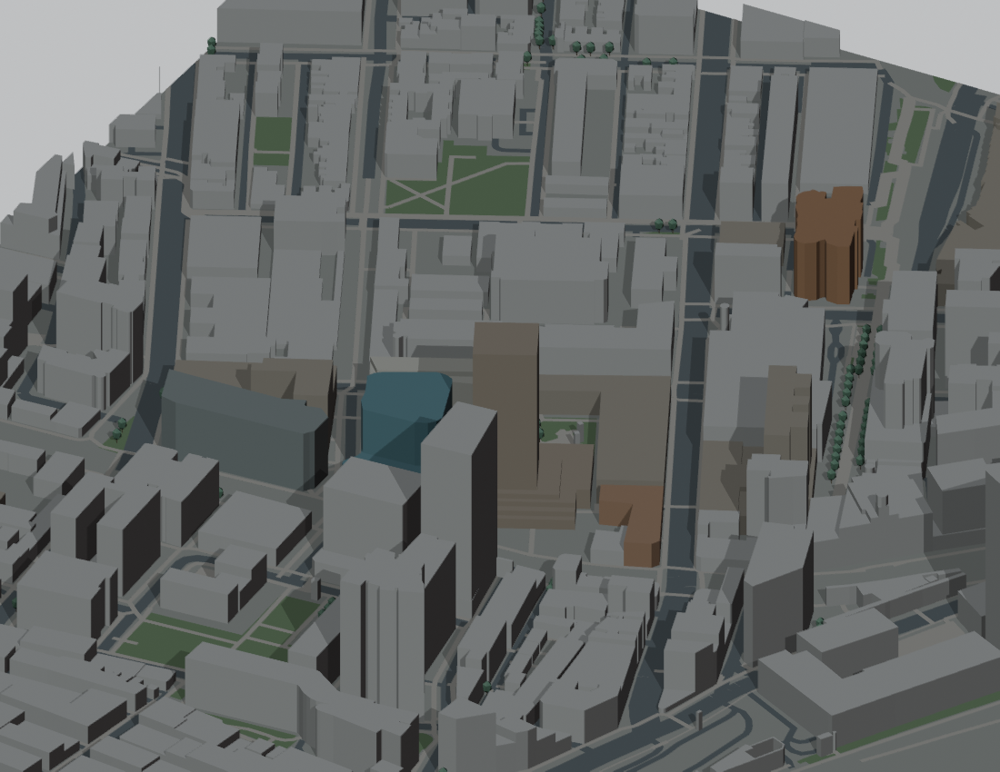

# v0.1.0 — Geographic foundation

Internal snapshot: P001  
Snapshot saved (UTC): 2026-09-16T06:36:54.451414+00:00  
Public release UUID: `e366c432-b5c1-52bb-8e62-2f4bb3d22cec`  
[Public release](https://github.com/z-hstudio/uts-city-campus-reconstruction/releases/tag/v0.1.0)

## Main changes

Mapped building footprints/parts, roads, walks, green polygons and tree proxies established a coherent city-campus base.

## Before / after

No accepted geographic model → broad mapped LOD1 base.

## Historical limitations

Greybox massing, floor-derived heights, flat ground; no faithful landmark facades.

## Why this is a major milestone

First complete geographic scene; not a claim of complete campus detail.

Original model: Manyousang Z / z-hstudio. © OpenStreetMap contributors, ODbL 1.0. Previews are fresh renders of the saved historical geometry; they are not claimed to be images published at the historical time.
