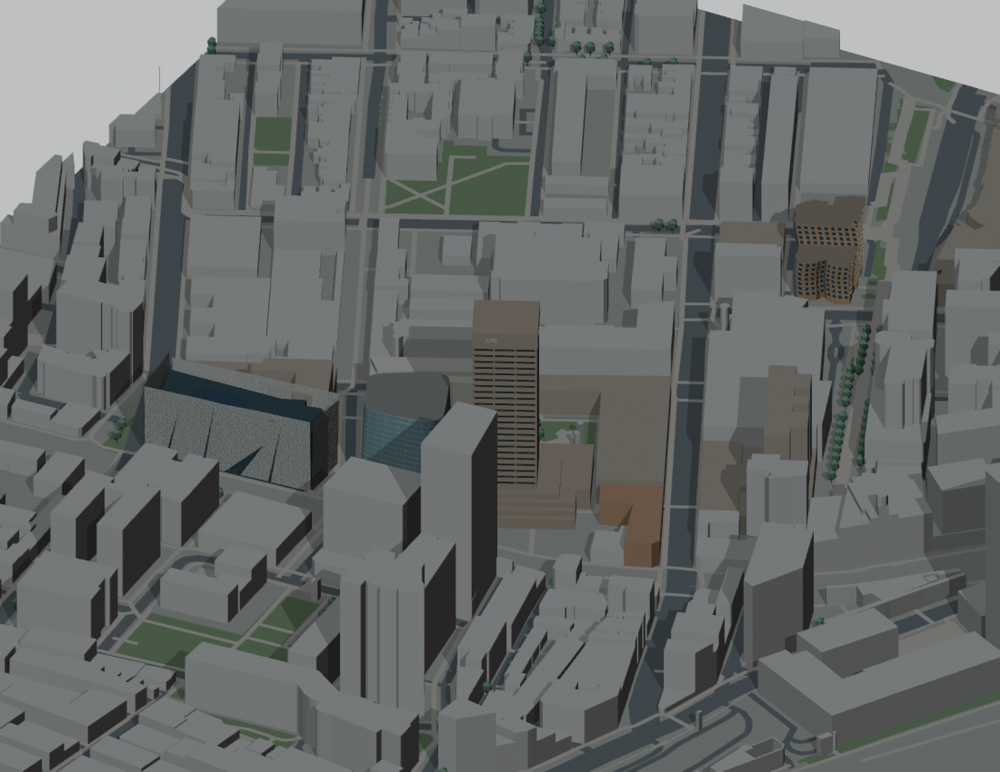

# v0.2.0 — First landmark identities

Internal snapshot: P005  
Snapshot saved (UTC): 2026-09-16T09:46:05.153276+00:00  
Public release UUID: `cdfa5d00-3304-5bcd-886c-7981b28e4df3`  
[Public release](https://github.com/z-hstudio/uts-city-campus-reconstruction/releases/tag/v0.2.0)

## Main changes

Tower horizontal language, Central glass volume, Engineering facade and Business School brick/glass treatments distinguish core landmarks.

## Before / after

Plain extrusions → first recognizable landmark material and facade families.

## Historical limitations

Early approximate roof and facade shapes; CB08 curvature incomplete.

## Why this is a major milestone

First combined landmark pass with materially different silhouettes/appearances.

Original model: Manyousang Z / z-hstudio. © OpenStreetMap contributors, ODbL 1.0. Previews are fresh renders of the saved historical geometry; they are not claimed to be images published at the historical time.
