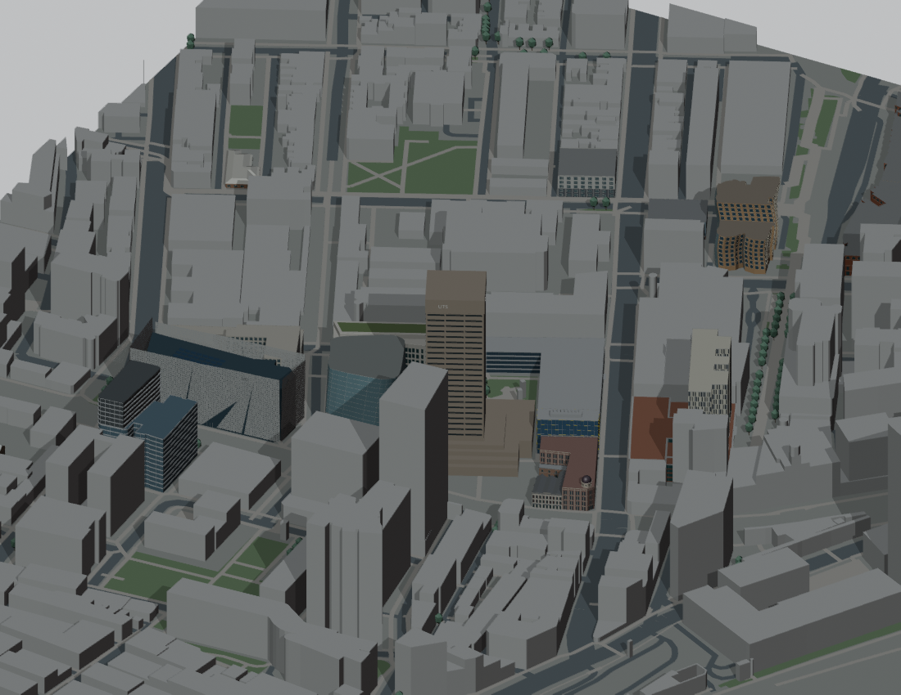

# v0.3.0 — Broader campus building coverage

Internal snapshot: P017  
Snapshot saved (UTC): 2026-09-16T12:28:14.466593+00:00  
Public release UUID: `1f3943db-ac64-5a09-8efc-363efe3f8c20`  
[Public release](https://github.com/z-hstudio/uts-city-campus-reconstruction/releases/tag/v0.3.0)

## Main changes

Ordinary buildings and Blackfriars/childcare context added characteristic masonry, roofs and simple windows alongside earlier landmarks.

## Before / after

Core landmarks → wider campus building family and precinct coverage.

## Historical limitations

Blackfriars relies partly on historical references; no certified current occupancy.

## Why this is a major milestone

Coverage expands beyond a few central landmark buildings.

Original model: Manyousang Z / z-hstudio. © OpenStreetMap contributors, ODbL 1.0. Previews are fresh renders of the saved historical geometry; they are not claimed to be images published at the historical time.
