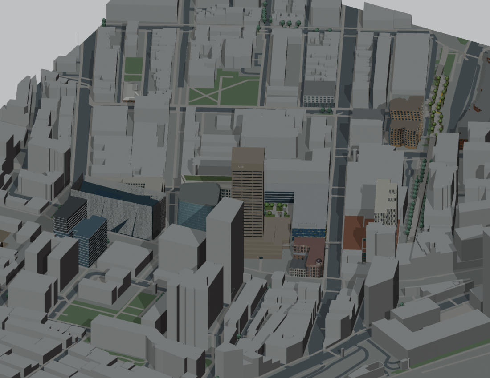

# v0.4.0 — Precinct landscape and connections

Internal snapshot: P024-r1  
Snapshot saved (UTC): 2026-09-16T14:24:51.167278+00:00  
Public release UUID: `9c7da6bd-0f0c-51f3-b98e-94279ca110eb`  
[Public release](https://github.com/z-hstudio/uts-city-campus-reconstruction/releases/tag/v0.4.0)

## Main changes

Alumni Green, Goods Line planting/paths, Haymarket links and Tower/Central entry proxies; revised P024-r1 includes an elevated Harris Street bridge proxy.

## Before / after

Separate building masses → linked public-space and entry relationships.

## Historical limitations

Flat terrain, estimated bridge dimensions and entrances; accessibility not certified.

## Why this is a major milestone

Major campus-space and connectivity milestone following earlier environment batches.

Original model: Manyousang Z / z-hstudio. © OpenStreetMap contributors, ODbL 1.0. Previews are fresh renders of the saved historical geometry; they are not claimed to be images published at the historical time.
