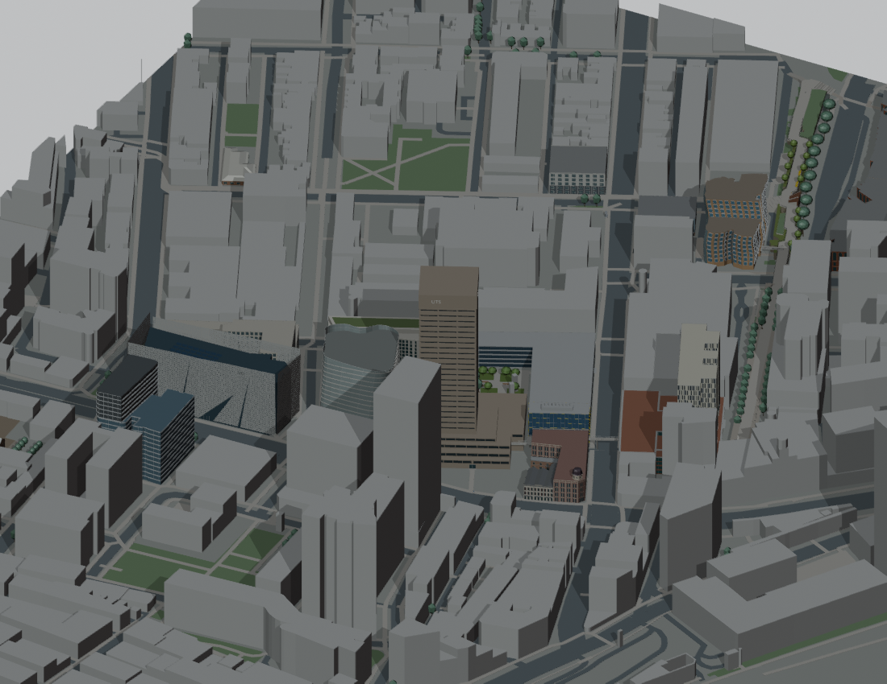

# v0.5.0 — Current Community Edition

Internal snapshot: P069  
Snapshot saved (UTC): 2026-09-18T05:21:26.069976+00:00  
Public release UUID: `f9009de0-8055-59a3-bc6d-84308251c325`  
[Public release](https://github.com/z-hstudio/uts-city-campus-reconstruction/releases/tag/v0.5.0)

## Main changes

Later landmark corrections, mapped trunk-road completion, planting revisions, Goods Line steps/landscape/paving and final P069 mapped lamp proxies.

## Before / after

First precinct connections → broader corrected architecture and more developed street/landscape spaces.

## Historical limitations

Still PARTIAL; unresolved local roof/entrance/grade details and approximate surrounding context.

## Why this is a major milestone

Latest accepted formal delivery P069_delivery, consolidating major independent improvements.

Original model: Manyousang Z / z-hstudio. © OpenStreetMap contributors, ODbL 1.0. Previews are fresh renders of the saved historical geometry; they are not claimed to be images published at the historical time.
